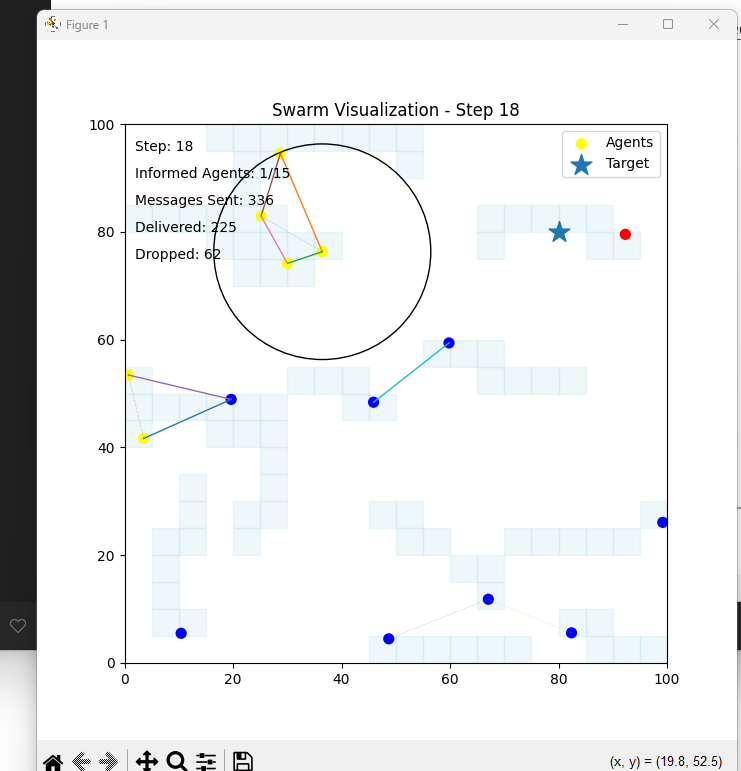
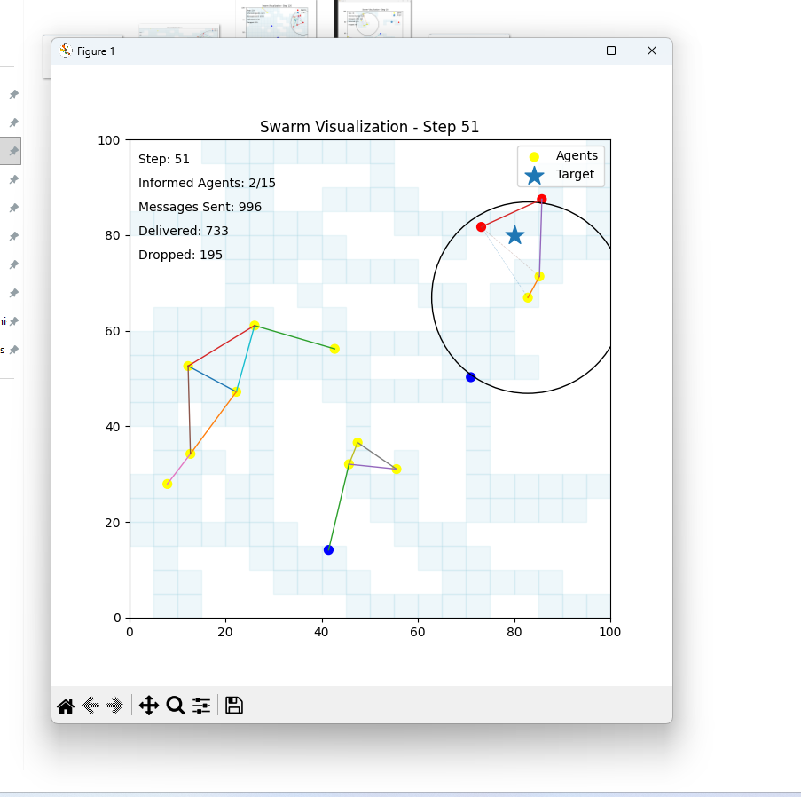
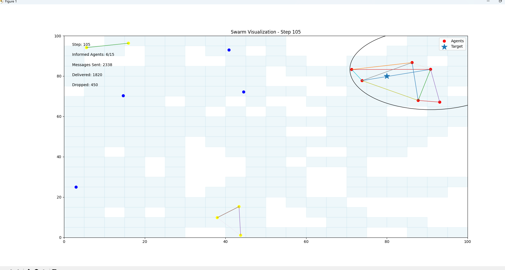
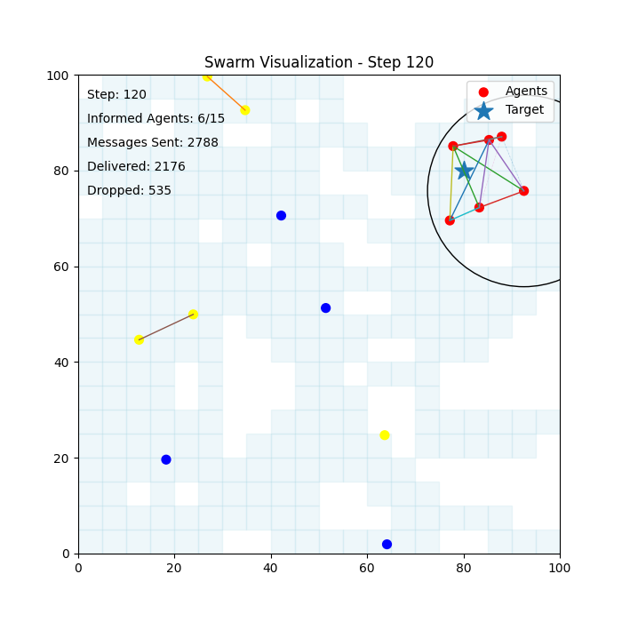

# Swarm-6G Mini Project – Communication-Constrained Multi-Agent Coordination

## Short Overview
This project presents a simulation framework for studying coordination dynamics in multi‑agent systems operating under communication constraints. It investigates how latency, packet loss and limited communication range influence information propagation, collective behaviour and convergence in distributed agent networks. The work is motivated by emerging challenges in 6G‑enabled systems, autonomous swarms and edge intelligence, where coordination must be achieved despite imperfect communication.

## Background and Motivation
In distributed autonomous systems such as drone swarms, robotic collectives and large‑scale sensor networks, coordination depends on reliable information exchange between agents. Real‑world communication channels, however, are inherently constrained by latency, packet loss and limited connectivity. While idealised models assume perfect communication, there is a lack of accessible frameworks for systematically analysing how these constraints affect system‑level behaviour. This project explores that gap by providing a controlled simulation environment for analysing communication‑aware coordination.

## Project Objective
The objective of this project is to model and analyse how communication constraints impact coordination efficiency, convergence behaviour and information dissemination in multi‑agent systems. The framework enables systematic experimentation with network parameters, linking observable simulation behaviour to underlying communication structure.

## Key Features
- **Parametrised communication conditions:** The simulation models latency, packet loss and communication radius separately and in combination, enabling fine‑grained exploration of their individual and joint impacts on coordination.
- **Decentralised agents:** Agents operate with no global state, coordinating through local interactions and peer‑to‑peer communication.
- **Exploration and convergence tasks:** Agents search for a target and converge once detection occurs, allowing analysis of both information dissemination and collective movement.
- **Visualisation of dynamics:** The framework generates visual outputs showing exploration patterns, information propagation, convergence over time and spatial coverage.
- **Measurable outcomes:** The simulation records convergence time, communication overhead and other metrics that quantify system performance under different conditions.

## Tools and Technologies
- **Python** for simulation development and agent‑based modelling  
- **NumPy** and **SciPy** for numerical computation  
- **Matplotlib** for visualising system dynamics and generating plots  
- **Graph‑theoretic analysis:** Concepts such as algebraic connectivity (Fiedler eigenvalue) provide a theoretical lens for interpreting simulation results.

## Methodology
1. Define the agent population, environment size and initial conditions.  
2. Parameterise the communication model with latency, packet loss and radius values.  
3. Run simulations of agent exploration, information exchange and convergence.  
4. Track information propagation and measure coordination performance under varied conditions.  
5. Analyse system‑level dynamics and interpret results using graph theory.  
6. Visualise outcomes to aid understanding of coordination patterns.

## Key Findings
Simulation results demonstrate that increasing latency and packet loss significantly degrade coordination efficiency. Information propagation becomes fragmented, leading to delayed or incomplete convergence. Reduced communication radius limits the reach of information flow, further slowing convergence. These findings reinforce the importance of communication‑aware design in distributed intelligent systems and highlight threshold effects where small parameter changes yield qualitatively different outcomes.

## Practical Impact
Understanding how communication constraints shape collective behaviour has real‑world value beyond academic interest. The insights gained here can inform the design of resilient autonomous swarms and distributed AI systems used in search‑and‑rescue, environmental monitoring, logistics and smart infrastructure. By linking simulation results to graph‑theoretic measures, the research identifies conditions under which coordination breaks down and suggests strategies for maintaining robustness in future 6G and edge‑intelligence deployments.

## Research and Practical Implications
This work bridges theory and application: it contributes to consensus and cooperation theory by quantifying the effects of communication parameters, and it offers a reusable computational framework for further research. The same framework can support investigations into 6G‑enabled autonomous systems, edge intelligence and swarm robotics, providing a testbed for evaluating communication‑aware algorithms.

## Visual Results

<p align="center">
  
</p>
Exploration dynamics illustrating agent movement under decentralised control.

<p align="center">
  
</p>
Information propagation across the communication network.

<p align="center">
  
</p>
Emergence of coordinated convergence following target detection.

<p align="center">
  
</p>
Spatial coverage distribution of agent activity.

## Project Structure

```
├── agents.py
├── experiments.py
├── main.py
├── metrics.py
├── network.py
├── simulation.py
├── visualization.py
├── images/
│   ├── exploration.png
│   ├── information_spread.png
│   ├── target_convergence.png
│   └── coverage_heatmap.png
├── results/
└── README.md````

## How to Run

Install dependencies:

```bash
pip install -r requirements.txt
````
Run a default simulation:

```bash
python main.py
```

Run a simulation with custom parameters (e.g., 20 agents, 50ms latency, 10% packet loss):

```bash
python experiments.py --agents 20 --latency 50 --loss 0.1
```

## Future Work
- Incorporate heterogeneous and dynamic communication models and explore adaptive or learning‑based coordination strategies.  
- Extend simulations to 3D environments and include real‑world constraints such as sensor noise and limited battery life.  
- Investigate the influence of network topology properties on coordination robustness and develop guidelines for designing resilient agent networks.
